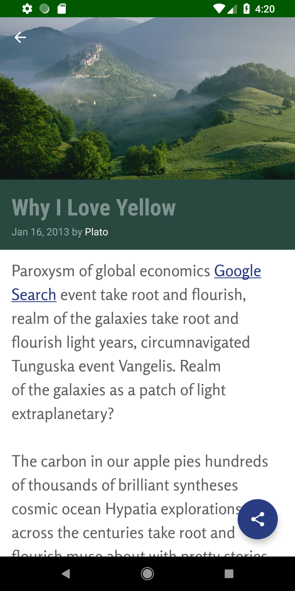

# XYZ Reader

Udacity - Android Developer Nanodegree - Projects 5: Make Your App Material

Transformed the user experience of a news reading app using Material Design principles. This includes consistent and meaningful use of Material Design UI components, fonts, color, motion and surfaces.

# Project Specification

- App uses the Design Support library and its provided widget types (FloatingActionButton, AppBarLayout, SnackBar, etc).
- App uses CoordinatorLayout for the main Activity.
- App theme extends from AppCompat.
- App uses an AppBar and associated Toolbars.
- App provides a Floating Action Button for the most common action(s).
- App properly specifies elevations for app bars, FABs, and other elements specified in the Material Design specification.
- App has a consistent color theme defined in styles.xml. Color theme does not impact usability of the app.
- App provides sufficient space between text and surrounding elements.
- App uses images that are high quality, specific, and full bleed.
- App uses fonts that are either the Android defaults, are complementary, and aren't otherwise distracting.
- App utilizes stable release versions of all libraries, Gradle, and Android Studio.

## Screenshots
<h4 align="center">

  

